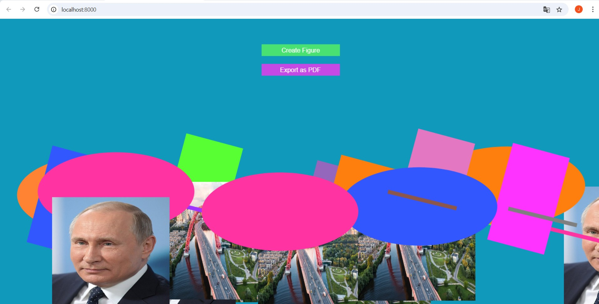

# Проект с PIXI.js

## Используемые технологии
- **pixi.js**
- **Typescript**
- **Webpack**

## Установка

1. Скачайте репозиторий по ссылке: [https://github.com/jordanwmp/pixi-graphics](https://github.com/jordanwmp/pixi-graphics)
2. Запустите `npm install`
3. Введите `npm start`

## Функционал

1. Добавляет фигуры и спрайты случайным образом на экран
2. Графика имеет интерактивность, такую как трансляция и масштабирование, при клике на нее
3. Сцену можно экспортировать в PDF
4. Интерфейс был создан с использованием **pixi.js** и не HTML (кнопки)

Проект доступен онлайн по ссылке: [https://pixijs-task.web.app/](https://pixijs-task.web.app/)

## Контакт

Email: [jordan.marques@discente.ufma.br](mailto:jordan.marques@discente.ufma.br)

Ваш друг из Бразилии 😊
